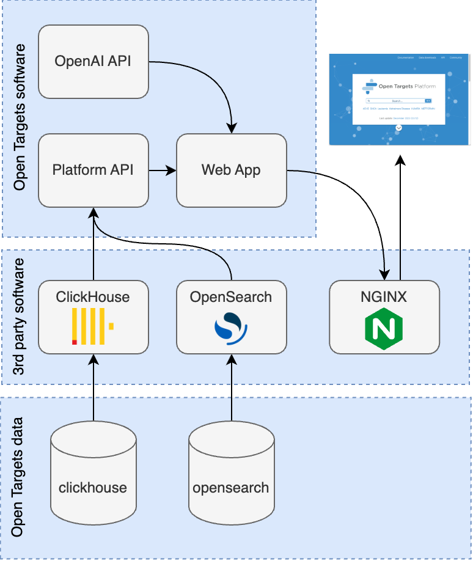

# Standalone local deployment for Open Targets Platform

This application enables a simple, customisable, local deployment of the [Open Targets Platform](https://platform.opentargets.org/).

The application fetches all of the necessary resources and components (below) and orchestrates their deployment with docker compose, so all you have to do is the configuration.

#### Resources: 
1. Open Targets data
   1. OpenSearch data - archived images are publicly available
   2. ClickHouse data - archived images are publicly available 
2. Open Targets software
   1. Web App - bundle is available from [repo](https://github.com/opentargets/ot-ui-apps)
   2. Platform API - publicly available as a docker image on [quay.io](https://quay.io/repository/opentargets/platform-api)
   3. OpenAI API - publicly available as a docker image on [quay.io](https://quay.io/repository/opentargets/ot-ai-api)
3. 3rd party software
   1. [OpenSearch](https://opensearch.org/)
   2. [ClickHouse](https://clickhouse.com/)
   3. [NGINX](https://www.nginx.com/)



## Quick start
```bash
# clone the repo
git clone https://github.com/opentargets/standalone-deployment-platform.git
# navigate to the project
cd standalone-deployment-platform
# set the profile
make set_profile profile=dev
# start the platform
make platform_up
```
*Note: the first time you specify a data image in your deployment, it will need to download it and this will take a relatively lone time, depending on the size of the image and the speed of the connection. Subsequent deployments with the same data image will not need to re-download, so they will be much faster.*

Visit the platform in your browser http://localhost:8080/

## Requirements
- [docker-compose](https://docs.docker.com/get-docker/)
- [gsutil](https://cloud.google.com/storage/docs/gsutil_install) (recommended)
- at least 100GB local storage (as of release 23.12)
  
## Deploying the platform locally
#### Configuration
This [config file](profiles/config.dev) can be used to config the components of the platform deployment. For example, configure the versions of the software or the path to the data images. This allows you to deploy the platform with any combination of software and data, including your own custom software and data.

To store multiple different configurations, other config files (profiles) can be created using the "profiles/config.<profile_name>" format. Top select the profile for the deployment, use the command `make set_profile profile=<profile_name>`. 

#### Usage
The interface is a CLI using GNU `make`. To see the full list of commands execute `make help`
```bash
make help

Usage:
  make <target>
  help                          Show this help message
  set_profile                   Set an active configuration profile, e.g. "make set_profile profile='dev'" (see folder 'profiles')
  clean_profile                 Clean the active configuration profile
  summary_environment           Print a summary of the configuration environment
  release                       Create a release folder for the data images to be stored
  download_release              Collect all the artifacts that make up an Open Targets Platform Release
  download_clickhouse           Collect the Clickhouse data image
  download_elastic_search       Collect the Elastic Search data image
  deployment                    Create a deployment folder where Open Targets Platform provisioners will deposit their artifacts
  deploy_clickhouse             Deploy ClickHouse
  deploy_elastic_search         Deploy Elastic Search
  deploy_webapp                 Deploy the Open Targets Platform Webapp
  deploy                        Deploy an Open Targets Platform Release, according to the active configuration profile
  clean_clickhouse              Clean the ClickHouse deployment
  clean_elastic_search          Clean the Elastic Search deployment
  clean_webapp                  Clean the Open Targets Platform Webapp deployment
  clean_deployments             Clean all deployments stores
  clean_clickhouse_release      Clean the Clickhouse data image
  clean_elastic_search_release  Clean the Elastic search data image
  clean_webapp_release          Clean the Open Targets Platform Webapp release bundle
  clean_release                 Clean all data images and webapp bundle
  platform_up                   Bring up an Open Targets Platform deployment
  platform_down                 Tear down an Open Targets Platform deployment
  clean                         Clean the active configuration profile, all deployments stores and data images
  ```
A general workflow would be:
1. Edit the [config](profiles/config.dev)
2. Set the profile: `make set_profile profile='dev'`
3. Deploy: `make platform_up`
4. Make a change to something, then repeat steps 1-3
5. Tear down: `make platform_down` or remove everything: `make clean`

Completed targets will not be rerun. For instance, if you have already made a deployment and only wish to change the version of the platform API, simply change the version in the config and rerun `make platform_up`. This will apply the changes but not repeat the download of all unchanged resources (which can take a long time).
